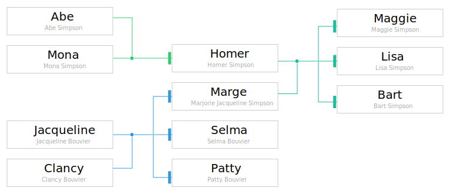
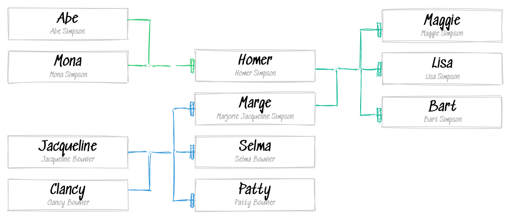

# Sketchviz Docker

Inspired by `sketchviz.com` (although unaffiliated).

This container bundles:

* Graphviz
* A script using [RoughJS](https://www.npmjs.com/package/roughjs) to "draw" the graphs
* Tooling needed to convert from `SVG -> PNG` (`svgexport`).

Tested with BitBucket Pipelines, see [example script](examples/build_diagrams.sh).

## Example Image

As an example, using [Kingraph](https://github.com/rstacruz/kingraph).

We take the [family file](examples/kingraph/simpsons.yml)

Which initially renders like this:

Then we run it through our converter and get this:

